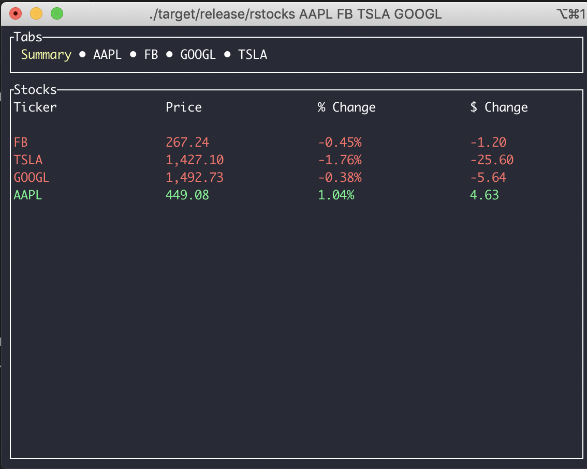
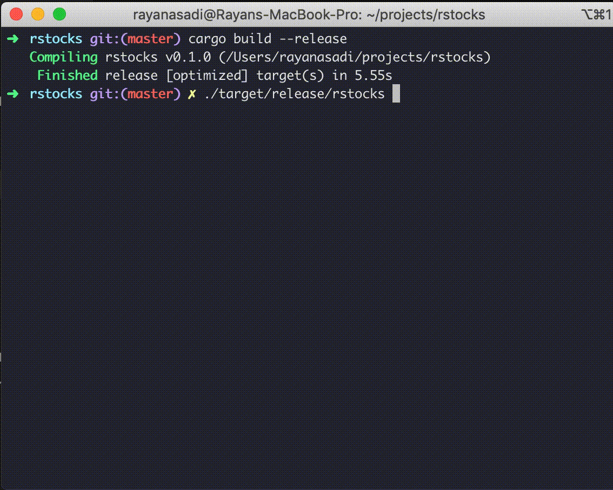

# 📈 rstocks

Terminal UI for viewing your stocks.

Pulls all data from yahoo finance, so anything support by it's API is also supported by this.

Built as a minimal project for testing out the `tui-rs` project for building terminal UIs, and
to try out rust multithreading.

Inspired by [https://github.com/jkwill87/stonky](https://github.com/jkwill87/stonky)

## Build and run

Build using `cargo build --release` and run using `./target/release/rstocks <List of stock names>`
